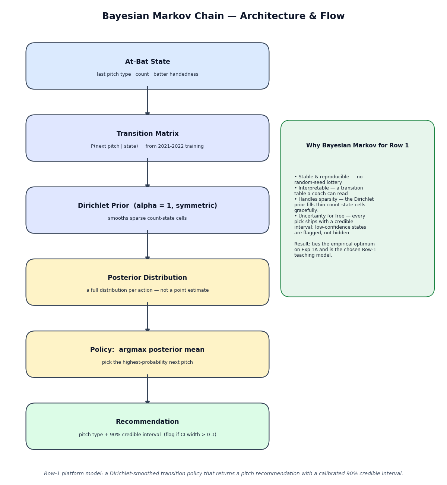
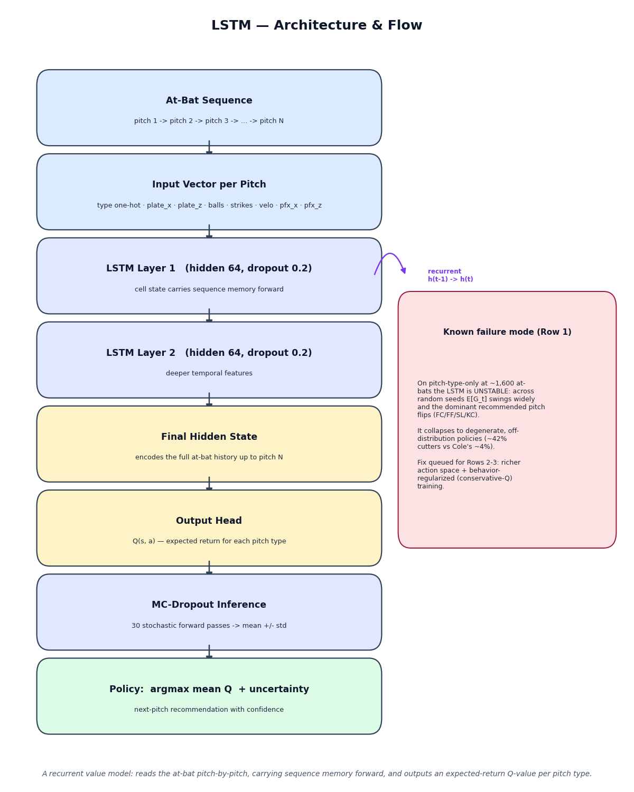
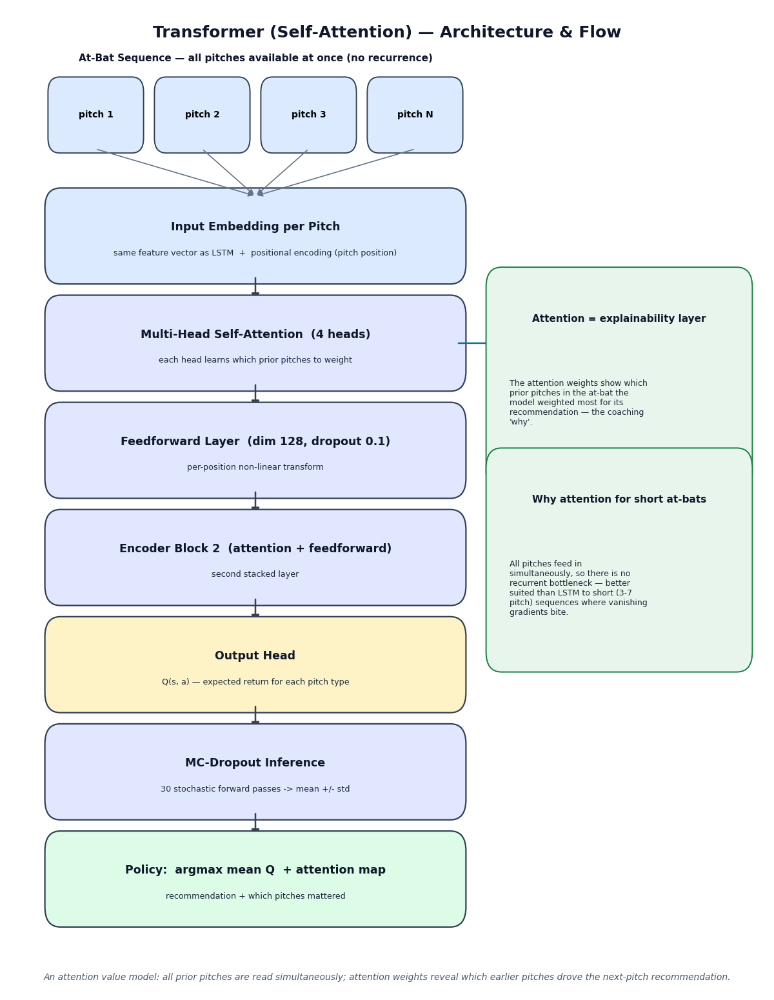

# Next Best Pitch — A Mathematical Approach

**Given what a pitcher has already thrown in an at-bat, what should they throw next — and why?**
Next Best Pitch turns that coaching question into a math problem. Using MLB Statcast
data, it models a plate appearance as a sequential decision process and learns a
*prescriptive policy*: for the current state (pitches thrown so far, count, batter
handedness), it recommends the next pitch that maximizes a defined outcome objective
— a swinging strike, weak contact, or a blend — and reports how confident it is. It
is **not** a descriptive "what does this pitcher tend to do" tool; it is an optimal
sequencing engine framed as a Markov Decision Process (MDP), built to become a
mathematically grounded teaching aid for pitchers and coaches. The current work
develops and validates the modeling stack on a single elite starter (Gerrit Cole)
before generalizing.

---

## Research Design

The project is a **3 × 3 experiment matrix**: three *reward functions* (what counts
as a good outcome) crossed with three *action spaces* (what the model gets to choose).
Every one of the nine cells runs the same six models, so results are directly comparable.

**Reward functions** — what the policy is optimizing for:
- **A · Whiff** — maximize swing-and-miss / strikeouts.
- **B · Weak Contact** — maximize weak/soft contact and outs-on-contact (uses exit velocity).
- **C · Combined** — a weighted blend of A and B (weights are logged hyperparameters).

**Action spaces** — what the model recommends:
- **1 · Pitch Type** — which pitch (FF, SL, KC, CH, FC).
- **2 · Location** — which zone of a 9-zone strike-zone grid.
- **3 · Type + Location** — the full (pitch, zone) decision.

| Action space ↓ \ Reward → | A — Whiff | B — Weak Contact | C — Combined |
|---|:---:|:---:|:---:|
| **1 — Pitch Type** | ✅ **1A** complete | ☑️ **1B** results in (review) | ☑️ **1C** results in (review) |
| **2 — Location** | ⬜ 2A | ⬜ 2B | ⬜ 2C |
| **3 — Type + Location** | ⬜ 3A | ⬜ 3B | ⬜ 3C |

Build order is **Row 1 first** (smallest action space, fastest to validate). Rows 2–3
follow once Row 1's signal quality and model ranking are confirmed.

---

## Model Stack

Every cell runs **six models**: three baselines that bracket the floor, three primary
competitors, and a queued set of secondary models for the final write-up.

### Baselines — establish the floor and the "hard to beat" target

- **Random Policy** — picks the next pitch uniformly at random. *Why:* the absolute
  floor; any model that can't beat it is useless. *Answers:* how much value is there
  to capture at all?
- **Empirical Frequency** — always throws the pitcher's most common pitch for the
  current count and handedness. *Why:* a deceptively strong "naive optimal" with no
  sequence modeling. *Answers:* does anything beat simply doing what the pitcher
  usually does?
- **Markov Chain** — a transition policy, `P(next pitch | last pitch, count, hand)`,
  with add-1 smoothing. *Why:* the gating model for memory — it uses exactly one
  pitch of history. *Answers:* does one step of sequence memory help, and is it the
  bar deeper models must clear?

### Primary models — the real competition

- **Bayesian Markov Chain** — the Markov transition table with a Dirichlet prior, so
  every recommendation comes with a posterior distribution rather than a point
  estimate. *Why:* it handles sparse count states gracefully and quantifies
  uncertainty for free. *Answers:* is a stable, interpretable probabilistic model
  enough on its own? **(On Row 1, the answer is yes — see Key Findings.)**
- **LSTM** — a recurrent neural network that reads the at-bat pitch-by-pitch, carrying
  sequence memory forward, and outputs an expected-return value for each pitch type.
  *Why:* the standard benchmark for whether multi-step sequence memory beats the
  one-step Markov chain. *Answers:* does *order* across the whole at-bat matter?
- **Transformer (self-attention)** — reads all prior pitches simultaneously and learns,
  via attention, which earlier pitches matter most for the next call. *Why:* at-bats
  are short (3–7 pitches), which suits attention better than recurrence; its attention
  weights double as a coaching explainability layer. *Answers:* which prior pitches
  drove this recommendation, and does attention out-model recurrence here?

Architecture diagrams: [Bayesian Markov](docs/diagrams/bayesian_markov_architecture.png) ·
[LSTM](docs/diagrams/lstm_architecture.png) ·
[Transformer](docs/diagrams/transformer_architecture.png).

| | |
|---|---|
|  |  |



### Secondary models — informative, queued (do not block the primary stack)

- **GRU** — a lighter recurrent alternative to the LSTM. *Answers:* if it matches the
  LSTM, the LSTM's extra complexity isn't justified.
- **MLP (feedforward)** — a flat model over concatenated inputs, no sequence structure.
  *Answers:* does sequence architecture matter at all versus a plain classifier?
- **Bayesian Logistic Regression** — an interpretable single-pitch baseline with
  uncertainty. *Answers:* if it matches the sequence models, history isn't adding value.
- **Hidden Markov Model (HMM)** — models the at-bat as hidden intent states
  (attack / expand / waste). *Answers:* does a latent "pitcher intent" structure,
  which maps onto how coaches think, explain sequencing?

---

## Key Findings (Row 1 — Pitch Type)

Scored by expected discounted return `E[G_t]` on the held-out 2023 season:

- **Bayesian Markov is the Row-1 platform model.** It is stable, interpretable, ties
  the empirical optimum, and ships a calibrated 90% credible interval with every
  recommendation (flagging the ~11% of states too uncertain to coach on). Exp 1A:
  Bayesian Markov `E[G_t] = 0.495`, matching the Markov and Empirical baselines.
- **The neural nets do not earn their complexity on pitch-type-only.** Across Rewards
  A, B, and C the LSTM and Transformer post higher raw scores, but the result does not
  hold up under scrutiny:
  - **Unstable** — across random seeds the score swings by 2–4× the evaluation
    standard error, and the model's single most-recommended pitch *flips* between
    seeds (e.g. cutter → fastball → slider → knuckle-curve).
  - **Degenerate & off-distribution** — the policies collapse onto one rare pitch
    (e.g. ~40–75% cutters or knuckle-curves), nothing like Cole's real ~53–90% fastball
    usage. A coach could not run them.
  - **Fallback-propped** — they over-recommend rare pitches in states the data can't
    price (>5% of decisions hit evaluator fallback, vs <0.5% for the baselines).
- **Pitch type alone is a weak lever.** Even the frequency baselines barely beat Random
  (~+0.02), which suggests *type* conditioned on count/handedness has limited leverage
  on plate-appearance outcomes — location, execution, and deeper sequencing likely
  carry more signal.

**What changes for Rows 2–3.** The neural-net failure is read as an *action-space and
data-volume* problem, not a model-quality verdict. The queued fixes (deferred until
the richer action spaces exist) are: pitch **location** as the action (more signal),
**behavior-regularized / conservative-Q** training (keep policies near the pitcher's
real distribution), reintroducing the deferred **per-pitch shaping** reward (denser
learning signal), and optional **league base-model pretraining** then per-pitcher
fine-tuning (more data, within the individual-pitcher constraint).

---

## Data

- **Source:** MLB Statcast via [`pybaseball`](https://github.com/jldbc/pybaseball).
- **Pitcher:** Gerrit Cole, **2021–2023** (individual-pitcher models only — no
  cross-pitcher inference in early experiments).
- **Volume:** **9,886 pitches** across **2,433 at-bats** — above the preferred 1,500+
  at-bat threshold. Train = 2021–2022, holdout = 2023.
- **Key columns** (full table in [`CLAUDE.md`](CLAUDE.md) → *Data*): `pitch_type`,
  `plate_x`/`plate_z`, `balls`/`strikes`, `stand`, `description`, `events`,
  `launch_speed`/`launch_angle`, `release_speed`, `pfx_x`/`pfx_z`, `at_bat_number`,
  `pitch_number`.
- **Not committed.** The cache is regenerated locally and is gitignored (`data/`).
  Run `python scripts/pull_data.py` to (re)build it; cached pulls are never re-fetched.

---

## Reward Structure

The reward is **terminal**: each at-bat is an episode, and the reward is realized at
the **final pitch** from the plate-appearance outcome (`events`), then credited back
across the earlier pitches as a discounted **Monte-Carlo return**:

```
G_t = Σ_{k ≥ t} γ^(k−t) · r_k        (here r_k = 0 except the terminal pitch)
    = γ^(T−t) · R_terminal            γ = 0.9
```

**Why terminal, not per-pitch?** An earlier design used an *immediate per-pitch* reward
scored by a *memoryless* (count, handedness, action) table. That design is provably
blind to sequence memory — every policy is capped by a memoryless reward-max oracle,
so the neural nets' apparent "wins" only reflected reward-greedy selection, not memory.
Crediting a **terminal** outcome back through the sequence makes this a genuine MDP in
which earlier-pitch decisions matter because they shape the rest of the at-bat — so
sequence memory can actually earn its keep.

**Why γ = 0.9?** It credits the terminal outcome back to earlier pitches with mild
discounting (a pitch closer to the result gets more of the credit), without vanishing
to zero across a 3–7 pitch at-bat. Confirmed as a working default; a sensitivity check
(0.95, 1.0) is deferred to post-Row-1.

**Terminal reward tables** (logged with every result):

| Outcome | A · Whiff | B · Weak Contact | C = 1.0·A + 0.7·B |
|---|---:|---:|---:|
| Strikeout | +1.5 | +1.0 | weighted sum |
| Out on contact — weak (EV < 85) | +0.8 | **+1.5** | weighted sum |
| Out on contact — hard (EV ≥ 85) | +0.8 | +0.4 | weighted sum |
| Single | −0.9 | −0.9 | weighted sum |
| XBH (2B/3B) | −1.3 | −1.2 | weighted sum |
| Home run | −1.6 | −1.6 | weighted sum |
| Walk / HBP | −1.0 | −0.8 | weighted sum |
| Barrel (EV ≥ 98, LA 26–30°) | — | **−2.0** | weighted sum |

Reward C default weights are **whiff = 1.0, weak-contact = 0.7**; an alternative
(0.8 / 0.9) is run as a sensitivity check. All models are scored by the **same**
history-aware off-policy estimator (`Q*` keyed on prev-pitch + count + handedness),
trained on 2021–2022 and evaluated on 2023, with fallback rates tracked and flagged.

---

## Repo Structure

```
CLAUDE.md                  authoritative spec — reward tables, evaluator, model stack, status
README.md                  this file
docs/diagrams/             model architecture diagrams (PNG)
experiments/               per-experiment scripts
  exp1a_returns_summary.py   Row-1 terminal-return (G_t) distribution sanity check
  exp1a_primary_gt.py        Exp 1A — six models under the terminal-reward MDP
  row1_lib.py                reusable Row-1 pipeline (run_cell)
  exp1bc.py                  Exp 1B / 1C / weight sensitivity / cross-experiment
  exp1a_baselines.py         (deprecated) memoryless-evaluator baselines
  exp1a_primary.py           (deprecated) memoryless-evaluator primary models
src/                       shared modules
  data.py                    load, reconstruct at-bats, train/holdout split, action space
  returns.py                 terminal reward tables (A/B/C) + Monte-Carlo returns G_t
  eval_returns.py            history-aware Q* evaluator + terminal-outcome model
  bayes_markov.py            Dirichlet Bayesian Markov chain (closed-form posterior + CI)
  nn_models.py               LSTM, Transformer, decision-example builder, MC-Dropout
  rewards.py / offpolicy.py  (legacy) per-pitch Reward A + deprecated memoryless evaluator
scripts/                   data pull, integrity check, diagram generation
  pull_data.py · integrity_check.py · make_diagrams.py
memory/                    project-state files for cross-session continuity (not app code)
data/                      local-only Statcast cache (gitignored)
```

---

## Status

- **Row 1 (pitch type) is complete.** Exp 1A is validated; Exp 1B and 1C results are in
  and reproduce the 1A pattern (Bayesian Markov stable and the platform model; neural
  nets unstable/degenerate across all three rewards). Awaiting final review.
- **Next:** Row 1 cross-experiment **agreement analysis** — where the whiff-optimal and
  weak-contact-optimal pitch agree vs. disagree (an early read shows they differ on
  ~19% of holdout states), then **Row 2 (location only)**, which is the first real test
  of whether a richer action space stabilizes the neural models.
- The full, authoritative project state lives in [`CLAUDE.md`](CLAUDE.md) → *Status*.

> **Hard constraints (never overridden):** individual-pitcher models only; every primary
> output carries an uncertainty estimate; Statcast data is cached locally and never
> re-pulled; Reward-C weights and γ are logged with every result.
